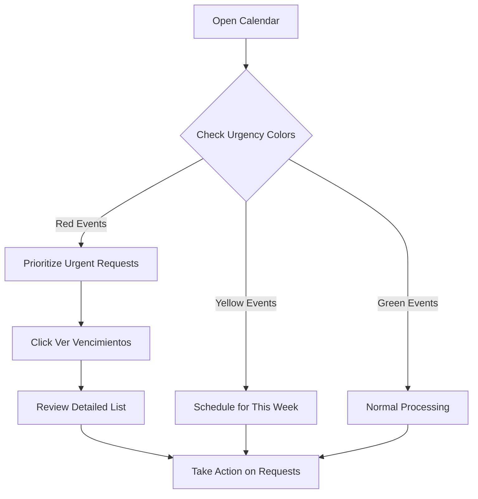

## Overview

The Calendar System is a powerful tool for visualizing and managing transparency request deadlines. It automatically calculates business days, displays upcoming due dates, and helps ensure timely responses to all requests.

<Info>
The calendar integrates with the Calendar Service and automatically excludes weekends, official holidays, and manually disabled days from deadline calculations.
</Info>

## Accessing the Calendar

Navigate to **Calendario** from the main menu. The calendar is available to all authenticated users with appropriate roles.

## Calendar Views

The system offers three different calendar views for flexible deadline tracking:

<CardGroup cols={3}>
  <Card title="Day View" icon="calendar-day">
    Detailed hourly view of a single day's events
  </Card>
  
  <Card title="Week View" icon="calendar-week">
    Seven-day overview with all scheduled deadlines
  </Card>
  
  <Card title="Month View" icon="calendar">
    Full month view with color-coded deadlines (default)
  </Card>
</CardGroup>

## Request Events

### Event Display

Each transparency request appears as an event on the calendar:

- **Event Title**: `[Folio] – [Requester Name]`
- **Start Date**: Request submission date
- **End Date**: Response deadline
- **Color Coding**: Based on urgency and request type

```csharp
// Event structure
public class EventoSolicitud
{
    public string Title { get; set; }        // Folio - Name
    public DateTime Start { get; set; }       // Request start date
    public DateTime End { get; set; }         // Deadline
    public string TipoSolicitud { get; set; } // DAI or ARCO
    public bool TienePrevencion { get; set; } // Has prevention
    public bool EsUrgente { get; set; }       // Is urgent
}
```

### Color Coding by Urgency

Events are automatically color-coded based on business days remaining:

<Tabs>
  <Tab title="Verde (Green)">
    **6+ business days remaining**
    
    - Plenty of time to respond
    - Standard processing
    - Background: Light green (#d4edda)
    - Border: Green (#28a745)
  </Tab>
  
  <Tab title="Amarilla (Yellow)">
    **3-5 business days remaining**
    
    - Approaching deadline
    - Requires attention soon
    - Background: Light yellow (#fff3cd)
    - Border: Yellow (#ffc107)
  </Tab>
  
  <Tab title="Roja (Red)">
    **Less than 3 business days**
    
    - Urgent attention required
    - Deadline approaching quickly
    - Background: Light red (#f8d7da)
    - Border: Red (#dc3545)
  </Tab>
  
  <Tab title="Gris (Gray)">
    **Overdue (negative days)**
    
    - Deadline has passed
    - Immediate action needed
    - Background: Gray (#e2e3e5)
    - Border: Dark gray (#6c757d)
  </Tab>
</Tabs>

### Color Coding by Request Type

In addition to urgency, events can be styled by request type:

- **DAI**: Purple background tooltip
- **ARCO**: Blue background tooltip
- **No Type**: Gray background tooltip

## Deadline Priority

The system automatically determines which deadline to display based on priority:

<Steps>
  <Step title="Prevention Deadline (Highest Priority)">
    If a request has an active prevention (prevención), the 10-day prevention deadline is displayed
  </Step>
  
  <Step title="Extension Deadline">
    If an extension (ampliación) was granted, the extended deadline (20 or 40 days) is shown
  </Step>
  
  <Step title="Standard Deadline">
    The original deadline (10 days for DAI, 20 days for ARCO) is displayed
  </Step>
</Steps>

```csharp
// Deadline priority logic
DateTime? fechaFin = null;

if (expediente.Prevencion == true && 
    expediente.FechaLimitePrevencion10dias.HasValue)
{
    fechaFin = expediente.FechaLimitePrevencion10dias.Value;
}
else if (expediente.Ampliacion == "SI" && 
         expediente.FechaLimiteRespuesta20dias.HasValue)
{
    fechaFin = expediente.FechaLimiteRespuesta20dias.Value;
}
else if (expediente.FechaLimiteRespuesta10dias.HasValue)
{
    fechaFin = expediente.FechaLimiteRespuesta10dias.Value;
}
```

## Business Day Calculation

### Non-Working Days

The calendar automatically excludes:

1. **Weekends**: Saturdays and Sundays
2. **Official Holidays**: Mexican federal holidays
3. **Manual Adjustments**: Custom non-working days set by administrators

### Official Holidays

The system includes the following Mexican federal holidays:

- January 1: Año Nuevo (New Year)
- February 5: Día de la Constitución (Constitution Day)
- March 21: Natalicio de Benito Juárez (Benito Juárez's Birthday)
- May 1: Día del Trabajo (Labor Day)
- September 16: Día de la Independencia (Independence Day)
- November 2: Día de Muertos (Day of the Dead)
- November 20: Día de la Revolución Mexicana (Revolution Day)
- December 12: Día de la Virgen de Guadalupe (Virgin of Guadalupe Day)
- December 24: Nochebuena (Christmas Eve)
- December 25: Navidad (Christmas)
- December 31: Fin de año (New Year's Eve)

```csharp
private readonly List<DateTime> diasFestivos = new List<DateTime>
{
    new DateTime(DateTime.Now.Year, 1, 1),   // New Year
    new DateTime(DateTime.Now.Year, 2, 5),   // Constitution Day
    new DateTime(DateTime.Now.Year, 3, 21),  // Benito Juárez
    new DateTime(DateTime.Now.Year, 5, 1),   // Labor Day
    // ... additional holidays
};
```

### Working Day Logic

A day is considered a working day if:

```csharp
private bool EsDiaLaborable(DateTime fecha)
{
    return fecha.DayOfWeek != DayOfWeek.Saturday &&
           fecha.DayOfWeek != DayOfWeek.Sunday &&
           !diasFestivos.Contains(fecha.Date) &&
           !diasApagadosManualmente.Contains(fecha.Date);
}
```

### Calculate Business Days Between Dates

The system can calculate business days between any two dates:

```csharp
private int CalcularDiasHabiles(DateTime inicio, DateTime fin)
{
    int dias = 0;
    DateTime fecha = inicio;
    int step = fin >= inicio ? 1 : -1;
    DateTime endDate = fin.AddDays(step);
    
    while (fecha != endDate)
    {
        if (EsDiaLaborable(fecha)) dias += step;
        fecha = fecha.AddDays(step);
    }
    
    return Math.Abs(dias);
}
```

## Calendar Controls

### Show/Hide Header

Toggle the calendar header display using the switch in the control bar:

```razor
<RadzenLabel Text="Mostrar encabezado:" />
<RadzenSwitch @bind-Value="@showHeader" />
```

### View Expiring Requests

Click **"Ver vencimientos"** (blue button) to see a list of requests expiring soon:

- Shows requests with less than 6 business days remaining
- Sorted by urgency (most urgent first)
- Opens in a dialog window
- Displays detailed information for each urgent request

<CodeGroup>
```csharp Filter Expiring Requests
async Task MostrarEventosPorVencimiento()
{
    var hoy = DateTime.Now.Date;
    
    var eventosVencidos = eventos
        .Where(e => CalcularDiasHabiles(hoy, e.End.Date) < 6)
        .OrderBy(e => CalcularDiasHabiles(hoy, e.End.Date))
        .ToList();
    
    await DialogService.OpenAsync<VerEventosVencimiento>(
        "Vencimiento de Solicitudes", 
        new Dictionary<string, object> { { "Eventos", eventosVencidos } },
        new DialogOptions { Width = "1000px", Height = "700px" });
}
```
</CodeGroup>

## Managing Non-Working Days

<Warning>
This feature is only available to users with ADMINISTRADOR or SUPERVISIÓN roles.
</Warning>

### Enable/Disable Specific Days

Administrators can manually mark any day as non-working:

<Steps>
  <Step title="Select Date">
    Use the date picker in the control bar to select a date
  </Step>
  
  <Step title="Toggle Status">
    Click **"Activar/Desactivar día"** (green button)
  </Step>
  
  <Step title="Automatic Recalculation">
    All request deadlines are automatically recalculated based on the new non-working days
  </Step>
</Steps>

```csharp
async Task ToggleDiaManual()
{
    if (fechaSeleccionada.HasValue)
    {
        var fecha = fechaSeleccionada.Value.Date;
        
        if (diasApagadosManualmente.Contains(fecha))
        {
            diasApagadosManualmente.Remove(fecha);
            await CalendarioService.EliminarDiaInhabil(fecha);
        }
        else
        {
            diasApagadosManualmente.Add(fecha);
            await CalendarioService.GuardarDiaInhabil(
                new DiaInhabilManualDTO { Fecha = fecha });
        }
        
        // Reload and recalculate all events
        scheduler?.Reload();
    }
}
```

### Visual Indicators

Non-working days are visually distinct in the calendar:

- **Light gray background** with diagonal stripe pattern
- Applied to weekends, holidays, and manually disabled days
- **Blue background** for the current day

```css
.rz-scheduler-non-working-time-cell {
    background-color: rgba(248, 249, 250, 0.7) !important;
}

.rz-scheduler-non-working-time-cell::after {
    content: '';
    position: absolute;
    background-image: repeating-linear-gradient(
        45deg, 
        transparent, 
        transparent 2px, 
        rgba(0, 0, 0, 0.05) 2px, 
        rgba(0, 0, 0, 0.05) 4px
    );
}

.dia-actual {
    background-color: rgba(13, 110, 253, 0.15) !important;
    border-right: 1px solid #0d6efd !important;
    border-left: 1px solid #0d6efd !important;
}
```

## Event Tooltips

Hover over any calendar event to see detailed information:

- **Request title**: Folio and requester name
- **Request type**: DAI or ARCO
- **Start date**: When the request was received
- **End date**: Response deadline
- **Business days remaining**: Calculated in real-time

```csharp
args.Attributes["data-tooltip"] = $"{args.Data.Title}\n" +
                          $"Tipo: {args.Data.TipoSolicitud}\n" +
                          $"Inicio: {args.Data.Start:dd/MM/yyyy}\n" +
                          $"Fin: {args.Data.End:dd/MM/yyyy}\n" +
                          $"Días hábiles restantes: {diasHabilesRestantes}";
```

## Calendar Integration

The calendar integrates with multiple system services:

### Expediente Service

```csharp
@inject IExpedienteService ExpedienteService

// Load all requests for display
var expedienteList = await ExpedienteService.Lista();
```

### Calendario Service

```csharp
@inject ICalendarioService CalendarioService

// Load manually disabled days
diasApagadosManualmente = (await CalendarioService.ObtenerDiasInhabiles())
    .Select(d => d.Fecha.Date)
    .ToList();
```

## Best Practices

<Check>
**Regular monitoring**: Check the calendar daily for upcoming deadlines
</Check>

<Check>
**Use urgency view**: Regularly check the "Ver vencimientos" list to prioritize work
</Check>

<Check>
**Update non-working days**: Keep the calendar current with any special closures or holidays
</Check>

<Check>
**Color awareness**: Train staff to recognize the urgency color coding system
</Check>

<Check>
**Plan ahead**: Use the month view to plan resource allocation for busy periods
</Check>

## Workflow Example



## Role-Based Access

| Role | View Calendar | View Expiring | Manage Non-Working Days |
|------|--------------|---------------|-------------------------|
| CONSULTA | ✅ | ✅ | ❌ |
| CAPTURA | ✅ | ✅ | ❌ |
| SUPERVISIÓN | ✅ | ✅ | ✅ |
| ADMINISTRADOR | ✅ | ✅ | ✅ |

## Technical Notes

### Radzen Scheduler Component

The calendar uses Radzen's Scheduler component:

```razor
<RadzenScheduler @ref="@scheduler"
                 SlotRender="@OnSlotRender"
                 TItem="EventoSolicitud"
                 Data="@eventos"
                 StartProperty="Start"
                 EndProperty="End"
                 TextProperty="Title"
                 SelectedIndex="2"
                 AppointmentRender="@OnAppointmentRender">
    <RadzenDayView />
    <RadzenWeekView />
    <RadzenMonthView />
</RadzenScheduler>
```

### Performance Optimization

The system loads all events once during initialization and recalculates only when:
- A new request is added
- A non-working day is toggled
- The page is refreshed

## Next Steps

<CardGroup cols={2}>
  <Card title="Request Management" icon="file-text" href="/features/request-management">
    Learn how requests appear on the calendar
  </Card>
  
  <Card title="User Management" icon="users" href="/features/user-management">
    Understand role-based access to calendar features
  </Card>
</CardGroup>