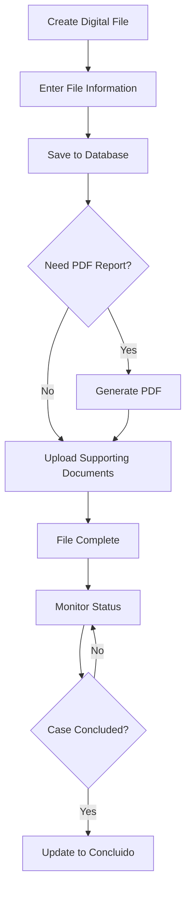

## Overview

The Digital Files module allows you to create, manage, and store complete digital records for revision resources (recursos de revisión). This feature is essential for tracking appeals and maintaining comprehensive documentation throughout the review process.

<Info>
The Digital Files feature is specifically designed for **Recursos de Revisión** (Revision Resources), which are appeals filed when requesters are dissatisfied with the initial response to their transparency request.
</Info>

## What is a Revision Resource?

A **Recurso de Revisión** is a formal appeal process where:
- A requester challenges the response to their transparency request
- The case is reviewed by an oversight body
- Additional documentation and evidence can be submitted
- A final resolution is issued

## Creating a Digital File

### Access the Module

Navigate to **Recursos Revisión → Registro → Expediente Digital** from the main menu.

### File Information Fields

The digital file captures comprehensive information about the revision resource:

<AccordionGroup>
  <Accordion title="Basic Information">
    - **Número de Recurso**: Unique resource number
    - **Estatus**: Status (En trámite, Concluido)
    - **Resolución en Sentido**: Resolution type
    - **Nombre Recurrente**: Name of the appellant
    - **Folio**: Original request folio
  </Accordion>
  
  <Accordion title="Content Details">
    - **Contenido Solicitud**: Original request content
    - **Respuesta Solicitud**: Response to the original request
    - **Sentido Contestación**: Response direction
    - **Materia**: Subject matter (DAI, DP)
    - **Razón**: Reason for filing the appeal
  </Accordion>
  
  <Accordion title="Important Dates">
    - **Fecha Notificación Admisión**: Admission notification date
    - **Fecha Acuerdo**: Agreement date
    - **Fecha Notificación**: Notification date
    - **Fecha Contestación**: Response date
    - **Fecha Acuerdo Final**: Final agreement date
  </Accordion>
  
  <Accordion title="Agreements and Resolutions">
    - **Contenido Acuerdo**: Agreement content
    - **Contenido Acuerdo Final**: Final agreement content
  </Accordion>
</AccordionGroup>

### Resolution Types

The system supports five types of resolutions:

<CardGroup cols={2}>
  <Card title="Confirma" icon="check">
    Upholds the original response
  </Card>
  
  <Card title="Sobresee" icon="ban">
    Dismisses the appeal
  </Card>
  
  <Card title="Modifica" icon="pen">
    Modifies the original response
  </Card>
  
  <Card title="Revoca" icon="xmark">
    Revokes the original response
  </Card>
  
  <Card title="Dar Respuesta" icon="reply">
    Orders a new response to be provided
  </Card>
</CardGroup>

## Data Entry Interface

The digital file uses a comprehensive table interface for efficient data entry:

```razor
<table class="table table-bordered table-striped">
    <tbody>
        <tr>
            <td><input class="form-control" @bind="Modelo.NumeroRecurso" /></td>
            
            <td>
                <select class="form-select" @bind="Modelo.Estatus">
                    <option value="">--Seleccione--</option>
                    <option>En trámite</option>
                    <option>Concluido</option>
                </select>
            </td>
            
            <td>
                <select class="form-select" @bind="Modelo.ResolucionSentido">
                    <option value="">--Seleccione--</option>
                    <option>Confirma</option>
                    <option>Sobresee</option>
                    <option>Modifica</option>
                    <option>Revoca</option>
                    <option>Dar Respuesta</option>
                </select>
            </td>
        </tr>
    </tbody>
</table>
```

## Saving Digital Files

### Save File Information

Click the **"Guardar"** button to save the digital file to the database:

```csharp
private async Task Guardar()
{
    var resp = await Http.PostAsJsonAsync("api/RecursoRevision/Expediente", Modelo);
    
    if (resp.IsSuccessStatusCode)
    {
        var json = await resp.Content.ReadFromJsonAsync<CreacionExpedienteDTO>();
        Modelo.IdExpediente = json?.IdExpedienteCreado ?? 0;
        
        if (await JS.InvokeAsync<bool>("confirm", 
            "Expediente guardado correctamente.\n\n¿Desea generar PDF?"))
        {
            await GenerarPDF();
        }
    }
}
```

<Tip>
After saving, the system prompts you to generate a PDF version of the file for archival purposes.
</Tip>

## PDF Generation

### Generate File Report

The system can generate a comprehensive PDF report of the digital file:

1. Click **"Descargar PDF"** button (red button with PDF icon)
2. The system generates a formatted PDF with all file information
3. The PDF is automatically downloaded to your device

<CodeGroup>
```csharp PDF Generation
private async Task GenerarPDF()
{
    var resp = await Http.PostAsJsonAsync(
        "api/RecursoRevision/Expediente/PDF", Modelo);
    
    if (resp.IsSuccessStatusCode)
    {
        var pdf = await resp.Content.ReadAsByteArrayAsync();
        
        await JS.InvokeVoidAsync("downloadFileFromByteArray", new
        {
            ByteArray = pdf,
            FileName = "ExpedienteRevision.pdf",
            ContentType = "application/pdf"
        });
    }
}
```
</CodeGroup>

## Document Management

### Upload PDF Documents

The digital file system allows you to attach external PDF documents to each file:

<Steps>
  <Step title="Open Upload Panel">
    Click **"Agregar PDF"** (blue button) to open the document upload panel
  </Step>
  
  <Step title="Select PDF File">
    Use the file picker to select a PDF document from your computer
  </Step>
  
  <Step title="Save Document">
    Click **"Guardar"** in the upload panel to attach the document to the file
  </Step>
</Steps>

<Warning>
The system only accepts PDF files. Other file formats will be rejected.
</Warning>

### Automatic File Creation

If you upload a document before saving the file information:

```csharp
// System automatically creates an empty file record
if (Modelo.IdExpediente == 0)
{
    var resp = await Http.PostAsJsonAsync(
        "api/RecursoRevision/Expediente/CrearVacio", new { });
    var json = await resp.Content.ReadFromJsonAsync<CreacionExpedienteDTO>();
    Modelo.IdExpediente = json!.IdExpedienteCreado;
}
```

### View Saved Documents

Click **"Documentos Guardados"** (gray button) to see all PDF documents attached to files:

- View a list of all uploaded documents
- See document names
- Download individual documents
- Access documents from any file in the system

<Frame>
  
</Frame>

### Download Documents

Each document in the saved list has a **"Descargar"** button:

```csharp
private async Task DescargarPDF(int idArchivo)
{
    var resp = await Http.GetAsync(
        $"api/RecursoRevision/Expediente/PDF/{idArchivo}");
    
    // Extract real filename from HTTP headers
    var contentDisposition = resp.Content.Headers.ContentDisposition;
    string nombreReal = contentDisposition?.FileNameStar 
        ?? contentDisposition?.FileName 
        ?? $"archivo_{idArchivo}.pdf";
    
    var bytes = await resp.Content.ReadAsByteArrayAsync();
    
    await JS.InvokeVoidAsync("downloadFileFromByteArray", new
    {
        ByteArray = bytes,
        FileName = nombreReal,
        ContentType = "application/pdf"
    });
}
```

## Search and Edit Files

### File Search

Navigate to **Recursos Revisión → Búsqueda** to search for existing digital files:

- Search by **Folio** or **Número de Recurso**
- Real-time search as you type
- Results displayed in a comprehensive table

```razor
<input class="form-control"
       placeholder="Escriba el folio o número de recurso..."
       @bind="FolioBusqueda"
       @oninput="Buscar" />
```

### Inline Editing

The search results table supports inline editing:

1. Click **"Editar"** button on any file
2. Form fields become editable in the table
3. Modify any information
4. Click **"Guardar"** to save changes
5. Click **"Cancel"** to discard changes

<Info>
Date fields use a date picker, while dropdown fields (Estatus, Resolución Sentido, Materia) use select boxes with predefined options.
</Info>

## File Structure

The digital file data model includes:

```csharp
public class ExpedienteRevisionDTO
{
    public int IdExpediente { get; set; }
    public string? NumeroRecurso { get; set; }
    public string? Estatus { get; set; }
    public string? ResolucionSentido { get; set; }
    public string? ContenidoSolicitud { get; set; }
    public string? NombreRecurrente { get; set; }
    public string? SentidoContestacion { get; set; }
    public DateTime? FechaNotificacionAdmision { get; set; }
    public string? RespuestaSolicitud { get; set; }
    public DateTime? FechaAcuerdo { get; set; }
    public string? ContenidoAcuerdo { get; set; }
    public string? MateriaRecurso { get; set; }
    public string? RazonInterposicion { get; set; }
    public DateTime? FechaNotificacion { get; set; }
    public string? FolioSolicitud { get; set; }
    public DateTime? FechaContestacionRecurso { get; set; }
    public DateTime? FechaAcuerdoFinal { get; set; }
    public string? ContenidoAcuerdoFinal { get; set; }
}
```

## Best Practices

<Check>
**Complete all fields**: Fill in as much information as possible for comprehensive records
</Check>

<Check>
**Attach supporting documents**: Upload relevant PDF documents to support the file
</Check>

<Check>
**Use consistent naming**: Follow a standard naming convention for resource numbers
</Check>

<Check>
**Update status regularly**: Keep the Estatus field updated as the case progresses
</Check>

<Check>
**Generate PDF backups**: Create PDF reports of important files for archival purposes
</Check>

## Workflow Example



## Next Steps

<CardGroup cols={2}>
  <Card title="Revision Resources" icon="scale-balanced" href="/features/revision-resources">
    Learn about the complete revision resource workflow
  </Card>
  
  <Card title="Request Management" icon="file-text" href="/features/request-management">
    Understand how requests connect to revision resources
  </Card>
</CardGroup>