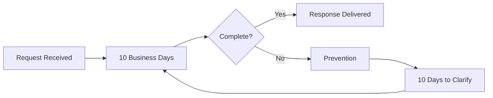
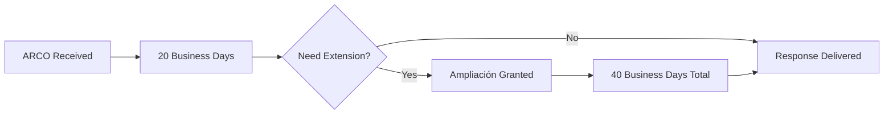

## Overview

The Request Management module is the core of the Sistema de Seguimiento de Solicitudes. It allows you to register and track transparency requests through their complete lifecycle, from initial submission to final response.

## Request Types

The system supports two main types of transparency requests:

<CardGroup cols={2}>
  <Card title="DAI Requests" icon="info-circle">
    **Derecho de Acceso a la Información** (Right to Information Access)
    - Response deadline: **10 business days**
    - Can be extended with ampliación (extension)
  </Card>
  
  <Card title="ARCO Requests" icon="shield-halved">
    **Acceso, Rectificación, Cancelación, Oposición** (Personal Data Rights)
    - Response deadline: **20 business days**
    - Includes subcategories: Access, Rectification, Cancellation, Opposition
  </Card>
</CardGroup>

## Creating a New Request

### Step 1: Access the Request Module

Navigate to **"Consulta de Solicitudes"** (Request Consultation) from the main menu. If you have the appropriate role (CAPTURA, SUPERVISIÓN, or ADMINISTRADOR), you'll see the **"Registrar Nueva Solicitud"** button.

<Info>
Users with the CONSULTA role can only view requests but cannot create or modify them.
</Info>

### Step 2: Fill in Basic Information

Click **"Registrar Nueva Solicitud"** to open the registration form. Enter the following required information:

- **Folio**: Unique identifier for the request (max 20 characters)
- **Nombre**: Name of the requester
- **Fecha de Inicio**: Start date of the request
- **Estatus**: Status (EN PROCESO or TERMINADA)
- **Contenido de la Solicitud**: Description of what is being requested

```csharp
// Example: Request model structure
public class ExpedienteDTO
{
    public string Folio { get; set; }
    public string NombreSolicitante { get; set; }
    public DateTime FechaInicio { get; set; }
    public string Estado { get; set; }
    public string ContenidoSolicitud { get; set; }
}
```

### Step 3: Submit the Request

The system automatically:
- Assigns the current date and time as the submission timestamp
- Validates that the folio is unique
- Adds the request to the database

## Managing Request Details

### Request Stages

Each request goes through three main stages:

<Steps>
  <Step title="Etapa Inicial (Initial Stage)">
    Request is received and basic information is captured
  </Step>
  
  <Step title="Etapa de Seguimiento (Follow-up Stage)">
    Request is being processed and may require prevention or extension
  </Step>
  
  <Step title="Etapa Final (Final Stage)">
    Response is delivered to the requester
  </Step>
</Steps>

### Detailed View

Click the **"Ver"** button on any request to access its detailed information page, where you can manage:

#### Basic Information
- **Tipo de Solicitud**: DAI or ARCO
- **Tipo de Derecho**: For ARCO requests only (Acceso, Rectificación, Cancelación, Oposición)
- **Mes de Admisión**: Month of admission
- **Año de Admisión**: Year of admission

#### Deadline Calculation

The system automatically calculates response deadlines based on:
- Request type (10 days for DAI, 20 days for ARCO)
- Extensions (ampliación doubles the deadline)
- Business days only (excludes weekends and holidays)
- Prevention periods (10 additional business days)

<CodeGroup>
```csharp Deadline Calculation Logic
private DateTime CalcularFechaLimite(DateTime inicio, int dias)
{
    var fecha = inicio.Date;
    while (dias > 0)
    {
        fecha = fecha.AddDays(1);
        if (fecha.DayOfWeek != DayOfWeek.Saturday &&
            fecha.DayOfWeek != DayOfWeek.Sunday &&
            !DiasInhabiles.Contains(fecha.Date))
        {
            dias--;
        }
    }
    return fecha;
}
```
</CodeGroup>

#### Prevention (Prevención)

If the request is incomplete or unclear:

1. Select **"Prevención" = Sí**
2. The system calculates a 10-business-day deadline for the requester to clarify
3. If clarified, select **"Subsana Prevención" = Sí** and the process restarts
4. The **"Fecha Límite para Prevención"** is automatically calculated

<Warning>
If prevention is not addressed within 10 business days, the request may be archived as incomplete.
</Warning>

#### Extension (Ampliación)

For complex requests requiring more time:

1. Select **"Ampliación" = Sí**
2. Response deadline is automatically doubled:
   - DAI: 10 → 20 business days
   - ARCO: 20 → 40 business days

## Request Search and Filtering

### Full-Text Search

Use the search bar to find requests by:
- Folio number
- Requester name
- Request content
- Date
- Year

The system performs a backend search across multiple fields to provide accurate results.

```razor
<!-- Search implementation -->
<input type="text" 
       class="form-control" 
       placeholder="🔍 Buscar por nombre, folio, contenido, fecha, año..." 
       @bind="Filtro" 
       @bind:event="oninput" />
```

### Request List View

The main request table displays:
- **ID**: System-assigned identifier
- **FOLIO**: Request folio number
- **NOMBRE**: Requester name
- **FECHA DE INICIO**: Submission date and time
- **ESTATUS**: Current status
- **CONTENIDO DE LA SOLICITUD**: Request description (truncated with "Ver más" option)

<Tip>
The table supports pagination to handle large volumes of requests efficiently. Results are ordered by ID (most recent first).
</Tip>

## Reception Methods

Requests can be received through:

- **PNT (Plataforma Nacional de Transparencia)**: National Transparency Platform
- **Manual**: Submitted directly to the office

### Delivery Preferences

Requesters can choose how they want to receive the response:
- **Electrónico PNT**: Through the national platform
- **Correo**: Email
- **Otro**: Other methods
- **No aplica**: Not applicable

## Role-Based Permissions

<AccordionGroup>
  <Accordion title="CONSULTA">
    - View all requests
    - Search and filter requests
    - Cannot create or modify requests
    - Warning message displayed: "Solo tienes permisos de lectura"
  </Accordion>
  
  <Accordion title="CAPTURA">
    - All CONSULTA permissions
    - Create new requests
    - Edit existing requests
    - Update request status
  </Accordion>
  
  <Accordion title="SUPERVISIÓN">
    - All CAPTURA permissions
    - Access to advanced tracking features
    - Committee follow-up functions
  </Accordion>
  
  <Accordion title="ADMINISTRADOR">
    - All SUPERVISIÓN permissions
    - System configuration
    - User management
    - Catalog management
  </Accordion>
</AccordionGroup>

## Best Practices

<Check>
**Use unique folios**: Always verify that the folio number doesn't already exist in the system
</Check>

<Check>
**Complete information**: Fill in as many fields as possible to facilitate tracking
</Check>

<Check>
**Monitor deadlines**: Regularly check the calendar to ensure timely responses
</Check>

<Check>
**Document prevention**: If requesting clarification, clearly document what information is needed
</Check>

<Check>
**Update status**: Keep the request status updated throughout its lifecycle
</Check>

## Common Workflows

### Standard DAI Request Flow



### ARCO Request with Extension



## Next Steps

<CardGroup cols={2}>
  <Card title="Calendar System" icon="calendar" href="/features/calendar-system">
    Learn how to track deadlines and manage non-working days
  </Card>
  
  <Card title="Digital Files" icon="folder" href="/features/digital-files">
    Explore digital file management for requests
  </Card>
</CardGroup>