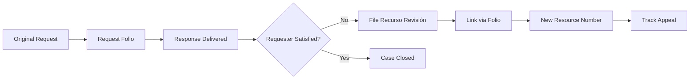
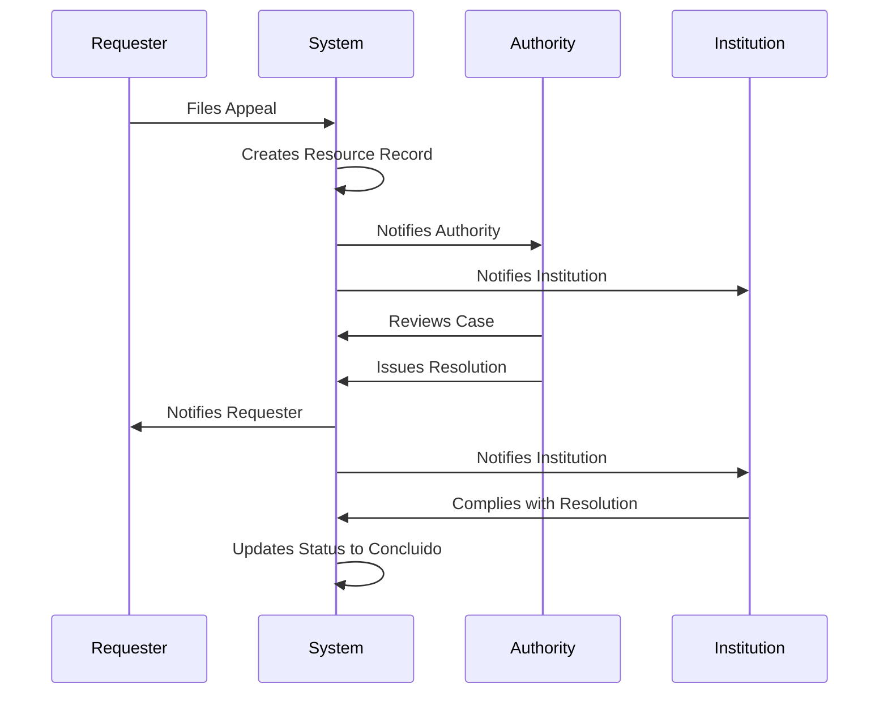

## Overview

The Revision Resources (Recursos de Revisión) module handles the appeals process when requesters are dissatisfied with the response to their transparency request. This feature allows tracking of the entire review and appeal workflow, from initial filing to final resolution.

<Info>
Revision Resources are a key part of transparency law compliance. When a requester disagrees with the response to their DAI or ARCO request, they can file a Recurso de Revisión to have their case reviewed by an oversight authority.
</Info>

## What is a Recurso de Revisión?

A **Recurso de Revisión** (Revision Resource or Appeal) is:

- A formal appeal filed by a transparency request requester
- Filed when the requester believes their request was improperly handled
- Reviewed by an independent oversight authority
- Results in a binding resolution
- Part of Mexico's transparency and access to information legal framework

## Appeal Workflow

<Steps>
  <Step title="Initial Request">
    A DAI or ARCO transparency request is submitted and processed
  </Step>
  
  <Step title="Response Delivered">
    The institution provides a response to the request
  </Step>
  
  <Step title="Appeal Filed">
    If unsatisfied, the requester files a Recurso de Revisión
  </Step>
  
  <Step title="Admission and Notification">
    The appeal is admitted and parties are notified
  </Step>
  
  <Step title="Review Process">
    The oversight authority reviews the case, may request additional information
  </Step>
  
  <Step title="Resolution">
    A final resolution is issued (Confirma, Modifica, Revoca, Sobresee, or Dar Respuesta)
  </Step>
  
  <Step title="Final Notification">
    All parties are notified of the resolution
  </Step>
</Steps>

## Module Components

The Revision Resources module includes several key features:

<CardGroup cols={2}>
  <Card title="Registration" icon="pen-to-square" href="/features/digital-files">
    Create and register new revision resources
  </Card>
  
  <Card title="Digital Files" icon="folder-open" href="/features/digital-files">
    Maintain comprehensive digital records
  </Card>
  
  <Card title="Search" icon="magnifying-glass">
    Search and edit existing revision resources
  </Card>
  
  <Card title="Statistics" icon="chart-bar">
    View analytics and statistics
  </Card>
</CardGroup>

## Creating a Revision Resource

### Basic Registration

To create a simple revision resource record:

1. Navigate to **Recursos Revisión → Registro**
2. Enter basic information:
   - **Número de Recurso**: Unique resource identifier
   - **Solicitud**: Link to the original request
   - **Motivo**: Reason for the appeal
   - **Observaciones**: Additional observations

```csharp
public class RecursoRevisionDTO
{
    public int Id { get; set; }
    public string? NumeroRecurso { get; set; }
    public string? Estatus { get; set; }
    public string? ResolucionSentido { get; set; }
    public int SolicitudId { get; set; }
    public string? Motivo { get; set; }
    public string? Observaciones { get; set; }
}
```

### Complete Digital File

For comprehensive tracking, use the **Expediente Digital** (Digital File) feature:

Navigate to **Recursos Revisión → Registro → Expediente** to access the full digital file interface.

<Note>
See the [Digital Files](/features/digital-files) documentation for detailed information on creating and managing complete revision resource files.
</Note>

## Appeal Status

Revision resources can have one of two statuses:

<Tabs>
  <Tab title="En trámite">
    **In Process**
    
    - The appeal is currently being reviewed
    - Documentation may still be collected
    - Resolution has not been issued
    - Active monitoring required
  </Tab>
  
  <Tab title="Concluido">
    **Concluded**
    
    - Final resolution has been issued
    - All parties have been notified
    - Case is closed
    - Archived for record-keeping
  </Tab>
</Tabs>

## Resolution Types

The oversight authority can issue five types of resolutions:

<AccordionGroup>
  <Accordion title="Confirma (Confirms)" icon="check">
    **Meaning**: The original response was correct and appropriate
    
    **Result**: The institution's response stands as originally provided
    
    **Action Required**: None (case concluded in favor of institution)
  </Accordion>
  
  <Accordion title="Sobresee (Dismisses)" icon="ban">
    **Meaning**: The appeal is dismissed for procedural reasons
    
    **Result**: The case is closed without reviewing the merits
    
    **Common Reasons**:
    - Filed outside the time limit
    - Requester withdrew the appeal
    - Lack of standing to appeal
  </Accordion>
  
  <Accordion title="Modifica (Modifies)" icon="pen">
    **Meaning**: The original response needs to be partially changed
    
    **Result**: The institution must provide an updated response with specific modifications
    
    **Action Required**: Revise and resubmit response according to the resolution
  </Accordion>
  
  <Accordion title="Revoca (Revokes)" icon="xmark">
    **Meaning**: The original response was incorrect or incomplete
    
    **Result**: The original response is nullified
    
    **Action Required**: Provide a completely new response
  </Accordion>
  
  <Accordion title="Dar Respuesta (Provide Response)" icon="reply">
    **Meaning**: No response was provided to the original request
    
    **Result**: The institution is ordered to provide a proper response
    
    **Action Required**: Generate and deliver a response to the requester
  </Accordion>
</AccordionGroup>

## Subject Matter

Revision resources are categorized by subject matter:

<CardGroup cols={2}>
  <Card title="DAI" icon="info-circle">
    **Derecho de Acceso a la Información**
    
    Appeals related to information access requests
  </Card>
  
  <Card title="DP" icon="shield-halved">
    **Datos Personales** (Personal Data)
    
    Appeals related to personal data protection (ARCO rights)
  </Card>
</CardGroup>

## Searching Revision Resources

### Search Interface

Navigate to **Recursos Revisión → Búsqueda** to search for existing resources:

```razor
<input class="form-control"
       placeholder="Escriba el folio o número de recurso..."
       @bind="FolioBusqueda"
       @oninput="Buscar" />
```

### Search Capabilities

The search function finds resources by:
- **Folio**: Original request folio number
- **Número de Recurso**: Appeal resource number

Search results are displayed in real-time as you type.

### Search Results

Results display in a comprehensive table showing all key information:

- Número de Recurso
- Estatus
- Resolución en Sentido
- Contenido Solicitud
- Nombre Recurrente
- Sentido Contestación
- All relevant dates
- Agreement contents

## Inline Editing

The search results support inline editing:

<Steps>
  <Step title="Find Resource">
    Use the search function to locate the resource
  </Step>
  
  <Step title="Click Edit">
    Click the **"Editar"** (yellow) button on the resource row
  </Step>
  
  <Step title="Modify Fields">
    Table cells become editable:
    - Text fields: Direct input
    - Date fields: Date picker
    - Dropdown fields: Select from options
  </Step>
  
  <Step title="Save or Cancel">
    - Click **"Guardar"** (green) to save changes
    - Click **"Cancel"** to discard changes
  </Step>
</Steps>

```csharp
private async Task Guardar(ExpedienteRevisionDTO row)
{
    var resp = await Http.PutAsJsonAsync(
        "api/RecursoRevision/Expediente/Actualizar", row);
    
    if (resp.IsSuccessStatusCode)
    {
        row.IsEditing = false;
        await JS.InvokeVoidAsync("alert", "Cambios guardados.");
    }
    else
    {
        await JS.InvokeVoidAsync("alert", "Error al guardar cambios.");
    }
}
```

## Important Dates

Revision resources track multiple critical dates:

<Tabs>
  <Tab title="Admission & Notification">
    **Fecha Notificación Admisión**
    
    Date when the appeal was officially admitted and parties were notified
  </Tab>
  
  <Tab title="Agreement">
    **Fecha Acuerdo**
    
    Date when an intermediate agreement or decision was reached
  </Tab>
  
  <Tab title="Notification">
    **Fecha Notificación**
    
    General notification date for communications
  </Tab>
  
  <Tab title="Response">
    **Fecha Contestación**
    
    Date when the appeal response was filed
  </Tab>
  
  <Tab title="Final Agreement">
    **Fecha Acuerdo Final**
    
    Date of the final resolution
  </Tab>
</Tabs>

## Integration with Requests

### Linking to Original Request

Each revision resource is linked to the original transparency request:

- **Folio Solicitud**: References the original request folio
- **Contenido Solicitud**: Shows what was originally requested
- **Respuesta Solicitud**: Contains the original response that prompted the appeal

### Request-to-Appeal Flow



## Statistics and Reporting

Navigate to **Recursos Revisión → Estadísticas** for analytics:

- Total number of appeals filed
- Appeals by status (En trámite vs Concluido)
- Appeals by resolution type
- Appeals by subject matter (DAI vs DP)
- Processing times and trends

<Note>
Statistics help identify patterns, improve response quality, and reduce appeal rates.
</Note>

## Document Management

### PDF Documents

Revision resources support comprehensive document management:

- Upload supporting documents
- Generate PDF reports of the file
- Download individual documents
- View all documents across resources

<Tip>
See the [Digital Files](/features/digital-files) documentation for detailed information on document management.
</Tip>

## Best Practices

<Check>
**Link to original request**: Always reference the original request folio
</Check>

<Check>
**Complete information**: Fill all fields to maintain comprehensive records
</Check>

<Check>
**Track deadlines**: Monitor legal deadlines for appeal processing
</Check>

<Check>
**Document everything**: Upload all relevant supporting documents
</Check>

<Check>
**Update status**: Change status to "Concluido" when resolution is final
</Check>

<Check>
**Record resolution details**: Clearly document the resolution type and content
</Check>

## Legal Compliance

### Timeframes

While specific timeframes may vary by jurisdiction, typical deadlines include:

- **Filing deadline**: 15 days from notification of the original response
- **Admission review**: 3-5 business days
- **Resolution deadline**: 40 business days from admission
- **Extension**: May be extended in complex cases

<Warning>
These are general guidelines. Always consult the specific legal framework applicable to your jurisdiction.
</Warning>

### Required Information

To comply with transparency laws, maintain:

- Complete appellant information
- Clear documentation of grounds for appeal
- All communications and notifications
- Detailed resolution with legal justification
- Notification records to all parties

## Common Scenarios

<AccordionGroup>
  <Accordion title="Incomplete Response">
    **Situation**: Requester believes information was withheld
    
    **Appeal Grounds**: Response does not address all points in the request
    
    **Likely Resolution**: Modifica or Revoca (if grounds are valid)
  </Accordion>
  
  <Accordion title="Delayed Response">
    **Situation**: Response was not provided within legal deadline
    
    **Appeal Grounds**: Violation of timeline requirements
    
    **Likely Resolution**: Dar Respuesta or Revoca
  </Accordion>
  
  <Accordion title="Denied Access">
    **Situation**: Request denied based on exception or exemption
    
    **Appeal Grounds**: Exception improperly applied
    
    **Likely Resolution**: Confirma (if proper) or Revoca (if improper)
  </Accordion>
  
  <Accordion title="Format Issues">
    **Situation**: Information provided in wrong format
    
    **Appeal Grounds**: Format doesn't match requester's needs
    
    **Likely Resolution**: Modifica (provide in requested format)
  </Accordion>
</AccordionGroup>

## Troubleshooting

<AccordionGroup>
  <Accordion title="Cannot find original request">
    **Solution**: Verify the folio number is correct. Use the request search function to locate the original request.
  </Accordion>
  
  <Accordion title="Changes not saving">
    **Solution**: Ensure all required fields are filled. Check for validation errors in date fields.
  </Accordion>
  
  <Accordion title="PDF generation fails">
    **Solution**: Verify that all required information is complete before generating PDF.
  </Accordion>
</AccordionGroup>

## Workflow Example



## Next Steps

<CardGroup cols={2}>
  <Card title="Digital Files" icon="folder-open" href="/features/digital-files">
    Learn how to create comprehensive digital files for appeals
  </Card>
  
  <Card title="Request Management" icon="file-text" href="/features/request-management">
    Understand how requests connect to revision resources
  </Card>
</CardGroup>