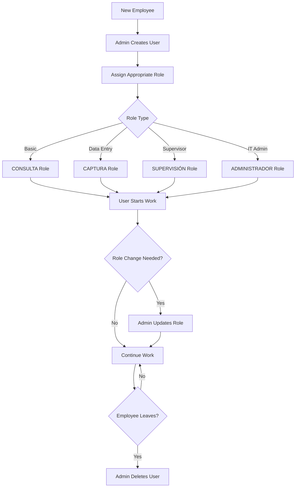

## Overview

The User Management system provides administrators with complete control over user accounts, roles, and permissions. The system implements a hierarchical role-based access control (RBAC) model to ensure proper security and workflow separation.

<Warning>
User Management features are **only accessible to users with ADMINISTRADOR or SUPERVISIÓN roles**. Attempting to access these features with other roles will result in access denial.
</Warning>

## Access Control

### Page-Level Authorization

The user management page enforces strict role-based access:

```csharp
@attribute [Authorize]
@attribute [Authorize(Roles = "ADMINISTRADOR, SUPERVISIÓN")]
```

## User Roles

The system defines four distinct user roles, each with specific permissions:

<AccordionGroup>
  <Accordion title="CONSULTA (View Only)" icon="eye">
    **Permissions:**
    - View all registered requests
    - Search and filter requests
    - Access calendar and reports
    - View digital files
    
    **Restrictions:**
    - Cannot create or modify requests
    - Cannot manage users
    - Cannot configure system settings
    - Cannot manage non-working days
    
    **Use Case:** External auditors, read-only observers, or staff who need visibility but not editing capabilities.
  </Accordion>
  
  <Accordion title="CAPTURA (Data Entry)" icon="keyboard">
    **Permissions:**
    - All CONSULTA permissions
    - Create new requests
    - Edit existing requests
    - Update request status
    - Manage request details
    - Upload documents
    
    **Restrictions:**
    - Cannot manage users
    - Cannot access system configuration
    - Cannot manage non-working days
    
    **Use Case:** Front-line staff responsible for registering and updating transparency requests.
  </Accordion>
  
  <Accordion title="SUPERVISIÓN (Supervisor)" icon="user-tie">
    **Permissions:**
    - All CAPTURA permissions
    - Committee follow-up functions
    - Manage non-working days in calendar
    - Create and manage users
    - Change user passwords
    - Oversight and quality control
    
    **Restrictions:**
    - Cannot access full system configuration
    
    **Use Case:** Team leaders, supervisors, and quality assurance staff who need to oversee operations and manage team members.
  </Accordion>
  
  <Accordion title="ADMINISTRADOR (Administrator)" icon="shield">
    **Permissions:**
    - All SUPERVISIÓN permissions
    - Full system configuration
    - Manage all users (including other admins)
    - Access to system catalogs
    - Database management
    - Complete system control
    
    **Restrictions:**
    - None (full access)
    
    **Use Case:** IT administrators and system managers with complete system responsibility.
  </Accordion>
</AccordionGroup>

## Creating Users

### Step-by-Step Process

<Steps>
  <Step title="Access User Management">
    Navigate to **Creacion de Usuarios** from the main menu (requires ADMINISTRADOR or SUPERVISIÓN role)
  </Step>
  
  <Step title="Click Add User">
    Click the green **"Agregar Nuevo Usuario"** button
  </Step>
  
  <Step title="Fill User Information">
    Complete the user creation form:
    - **Nombre del usuario**: Username for login
    - **Contraseña**: Initial password (minimum 8 characters)
    - **Rol**: Select appropriate role from dropdown
  </Step>
  
  <Step title="Review Role Description">
    The system displays a description of the selected role's permissions
  </Step>
  
  <Step title="Save User">
    Click **"Guardar"** to create the user account
  </Step>
</Steps>

### User Creation Form

```razor
<EditForm Model="NuevoUsuario" OnValidSubmit="GuardarUsuario">
    <DataAnnotationsValidator />
    <ValidationSummary />
    
    <label for="Nombre">Nombre del usuario:</label>
    <InputText id="Nombre" @bind-Value="NuevoUsuario.NombreUsuario" />
    
    <label for="password">Contraseña:</label>
    <div class="password-container">
        <InputText id="password"
                   class="form-control input-password"
                   type="@(_mostrarPassword ? "text" : "password")"
                   @bind-Value="NuevoUsuario.password" />
        <button type="button" 
                class="toggle-password" 
                @onclick="AlternarVisibilidad">
            <i class="bi @(_mostrarPassword ? "bi-eye-slash" : "bi-eye")"></i>
        </button>
    </div>
    
    <label for="Rol">Rol:</label>
    <InputSelect id="Rol" @bind-Value="NuevoUsuario.Rol">
        <option value="" disabled selected>Selecciona una opción:</option>
        @foreach (var Rol in ListaRoles)
        {
            <option value="@Rol">@Rol</option>
        }
    </InputSelect>
    
    @if (!string.IsNullOrEmpty(DescripcionRolSeleccionado))
    {
        <p style="font-size: 0.85rem; color: #555;">
            @DescripcionRolSeleccionado
        </p>
    }
</EditForm>
```

### Password Visibility Toggle

The password field includes a visibility toggle for easier data entry:

- Click the eye icon to show/hide the password
- Helps prevent typos during user creation
- Automatically hides password by default for security

```csharp
private bool _mostrarPassword = false;

private void AlternarVisibilidad()
{
    _mostrarPassword = !_mostrarPassword;
}
```

## Managing Existing Users

### User List View

The user management table displays:

- **ID**: Unique system identifier
- **NOMBRE**: Username
- **ROL**: Assigned role
- **ACCIONES**: Available actions (Change Password, Delete)

### Search and Filter

Quickly find users using the search bar:

```razor
<input type="text" 
       class="form-control" 
       placeholder="🔍 Buscar por Nombre, Id, Rol..." 
       @bind="Filtro" 
       @bind:event="oninput" />
```

Search filters by:
- Username
- User ID
- Role

<Tip>
The search updates in real-time as you type, making it easy to find specific users in large datasets.
</Tip>

### Pagination

The user list is paginated for better performance:

- Configurable page size (typically 12 users per page)
- **Anterior** (Previous) and **Siguiente** (Next) navigation
- Current page and total pages displayed
- Page size adjusts based on screen resolution

```csharp
private int pageSize = 12;
private int totalPages => (UsuariosFiltrados.Count + pageSize - 1) / pageSize;

private IEnumerable<UsuariosDTO> PagedUsuarios => UsuariosFiltrados
    .OrderByDescending(e => e.Id)
    .Skip((currentPage - 1) * pageSize)
    .Take(pageSize);
```

## Password Management

### Change User Password

Administrators and supervisors can reset passwords for any user:

<Steps>
  <Step title="Select User">
    Click the **"Cambiar Contraseña"** button (blue button with key icon) next to the user
  </Step>
  
  <Step title="Enter New Password">
    Type the new password in the modal form
    - Minimum 6 characters required
    - System validates the length automatically
  </Step>
  
  <Step title="Toggle Visibility">
    Use the eye icon to show/hide the password while typing
  </Step>
  
  <Step title="Save Changes">
    Click **"Guardar"** to update the password
  </Step>
</Steps>

### Password Requirements

<Info>
**Minimum Length**: 6 characters

While the system enforces a minimum of 6 characters, it's recommended to use stronger passwords with:
- Mix of uppercase and lowercase letters
- Numbers
- Special characters
</Info>

```csharp
public class CambioContrasenaModelClass
{
    [Required(ErrorMessage = "La nueva contraseña es requerida")]
    [MinLength(8, ErrorMessage = "Debe tener al menos 8 caracteres")]
    public string NuevaContrasena { get; set; } = string.Empty;
}

private async Task GuardarCambioContrasena()
{
    if (CambioContrasenaModel.NuevaContrasena.Length < 6)
    {
        await Swal.FireAsync("Error", 
            "La contraseña debe tener al menos 6 caracteres.", 
            SweetAlertIcon.Error);
        return;
    }
    
    var resultado = await UsuarioService.CambiarContrasena(
        UsuarioCambioContrasena.Id, 
        CambioContrasenaModel.NuevaContrasena);
    
    if (resultado)
    {
        await Swal.FireAsync("Éxito", 
            "Contraseña actualizada correctamente.", 
            SweetAlertIcon.Success);
    }
}
```

## Deleting Users

### Delete Process

<Warning>
Deleting a user is permanent and cannot be undone. Use caution when removing user accounts.
</Warning>

<Steps>
  <Step title="Click Delete">
    Click the red **"Eliminar"** button (trash icon) next to the user
  </Step>
  
  <Step title="Confirm Deletion">
    A SweetAlert confirmation dialog appears:
    - **Title**: "¿Estás seguro?"
    - **Message**: "No podrás revertir esto."
    - **Actions**: "Sí, eliminar" or "Cancelar"
  </Step>
  
  <Step title="System Removes User">
    If confirmed, the user is permanently deleted from the database
  </Step>
  
  <Step title="View Confirmation">
    Success message confirms the deletion
  </Step>
</Steps>

```csharp
private async Task Eliminar(int id)
{
    var resultado = await Swal.FireAsync(new SweetAlertOptions
    {
        Title = "¿Estás seguro?",
        Text = "No podrás revertir esto.",
        Icon = SweetAlertIcon.Warning,
        ShowCancelButton = true,
        ConfirmButtonText = "Sí, eliminar",
        CancelButtonText = "Cancelar"
    });
    
    if (resultado.IsConfirmed)
    {
        var eliminado = await UsuarioService.Eliminar(id);
        
        if (eliminado)
        {
            await Swal.FireAsync(new SweetAlertOptions
            {
                Title = "Eliminado",
                Text = "El usuario ha sido eliminado.",
                Icon = SweetAlertIcon.Success
            });
            
            ListaUsuarios = await UsuarioService.Lista_Usuarios();
        }
    }
}
```

## User Service Integration

The user management system integrates with the Usuario Service:

```csharp
@inject IUsuarioService UsuarioService

// Available service methods:
- Lista_Usuarios()           // Get all users
- Register(UsuariosDTO)      // Create new user
- CambiarContrasena(id, pwd) // Change password
- Eliminar(id)              // Delete user
```

## Data Model

```csharp
public class UsuariosDTO
{
    public int Id { get; set; }
    public string NombreUsuario { get; set; } = string.Empty;
    public string password { get; set; } = string.Empty;
    public string Rol { get; set; } = string.Empty;
}
```

## Best Practices

<Check>
**Use descriptive usernames**: Choose usernames that clearly identify the person
</Check>

<Check>
**Assign minimal permissions**: Give users only the access level they need
</Check>

<Check>
**Regular audits**: Periodically review user accounts and remove inactive users
</Check>

<Check>
**Document access**: Keep records of who has what level of access
</Check>

<Check>
**Immediate removal**: Delete user accounts immediately when employees leave
</Check>

<Check>
**Strong passwords**: Encourage users to create strong, unique passwords
</Check>

## Security Features

### Authentication

- Users must authenticate before accessing any part of the system
- Custom Authentication State Provider manages sessions
- Automatic session expiration for inactive users

### Authorization

- Role-based access control on every page
- Server-side validation of permissions
- UI elements hidden based on user role

### Password Security

- Passwords are hashed before storage
- Minimum length requirements enforced
- Password visibility toggle for secure entry

## Role-Based UI Elements

Different UI elements appear based on user role:

```razor
<!-- Example: Show button only for CAPTURA and higher -->
@if (PuedeCapturar)
{
    <button class="btn-agregar" @onclick="MostrarFormulario">
        Registrar Nueva Solicitud
    </button>
}

@code {
    private bool PuedeCapturar = false;
    
    protected override async Task OnInitializedAsync()
    {
        var authState = await AuthenticationStateProvider
            .GetAuthenticationStateAsync();
        var user = authState.User;
        
        PuedeCapturar = user.IsInRole("CAPTURA") || 
                       user.IsInRole("SUPERVISIÓN") || 
                       user.IsInRole("ADMINISTRADOR");
    }
}
```

## Troubleshooting

<AccordionGroup>
  <Accordion title="Cannot access user management">
    **Cause**: User does not have ADMINISTRADOR or SUPERVISIÓN role
    
    **Solution**: Contact an administrator to upgrade your role or have them perform the user management task
  </Accordion>
  
  <Accordion title="Username already exists error">
    **Cause**: Attempting to create a user with a username that's already in use
    
    **Solution**: Choose a different username. Usernames must be unique across the system
  </Accordion>
  
  <Accordion title="Password too short error">
    **Cause**: Password does not meet minimum length requirement
    
    **Solution**: Use a password with at least 6 characters (8+ recommended)
  </Accordion>
</AccordionGroup>

## Workflow Example



## Next Steps

<CardGroup cols={2}>
  <Card title="Request Management" icon="file-text" href="/features/request-management">
    See how different roles interact with requests
  </Card>
  
  <Card title="Calendar System" icon="calendar" href="/features/calendar-system">
    Learn about role-based calendar access
  </Card>
</CardGroup>