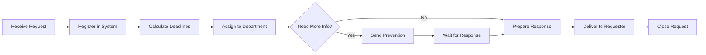
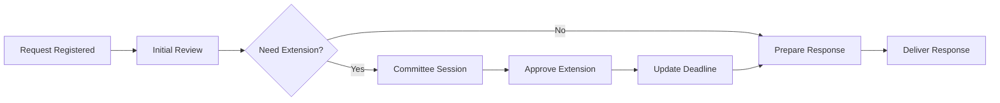

## Quick Start

This guide will walk you through setting up the Sistema de Seguimiento de Solicitudes and creating your first transparency request in under 10 minutes.

<Note>
Before you begin, ensure you have completed the [Installation](/installation) process. You should have both the API and frontend applications running.
</Note>

## Prerequisites Check

Verify you have:
- ✅ .NET 9.0 SDK installed
- ✅ SQL Server running
- ✅ Database imported and configured
- ✅ API running on `https://localhost:7123`
- ✅ Frontend running on `https://localhost:7125`

## Step 1: First Login

<Steps>
  <Step title="Access the Application">
    Open your browser and navigate to the frontend application:
    
    ```bash
    https://localhost:7125
    ```
    
    You should see the login page.
  </Step>
  
  <Step title="Create Your First User">
    Since this is a fresh installation, you'll need to create an admin user. Use the API endpoint or SQL Server Management Studio to create an initial user.
    
    <CodeGroup>
    ```bash Using curl
    curl -X POST https://localhost:7123/api/Auth/register \
      -H "Content-Type: application/json" \
      -d '{
        "nombreUsuario": "admin",
        "password": "Admin123!",
        "rol": "Administrador"
      }'
    ```
    
    ```sql Using SQL
    -- Run this in SQL Server Management Studio
    -- Note: Password will be hashed by the application
    INSERT INTO Usuarios (NombreUsuario, Rol)
    VALUES ('admin', 'Administrador');
    -- Then use the register endpoint to set password
    ```
    </CodeGroup>
  </Step>
  
  <Step title="Login to the System">
    Enter your credentials on the login page:
    
    - **Username**: admin
    - **Password**: Admin123!
    
    The system will authenticate you and generate a JWT token valid for 2 hours.
  </Step>
</Steps>

## Step 2: Understanding the Dashboard

After login, you'll see the main dashboard with several modules:

<CardGroup cols={2}>
  <Card title="Inicio de Solicitudes" icon="house">
    Create new transparency requests and view recent submissions
  </Card>
  <Card title="Historial de Solicitudes" icon="clock-rotate-left">
    View and search all historical requests
  </Card>
  <Card title="Índice de Expedientes" icon="folder-tree">
    Browse all case files with advanced filtering
  </Card>
  <Card title="Calendario" icon="calendar-days">
    View deadlines and manage working days
  </Card>
</CardGroup>

## Step 3: Create Your First Request

<Steps>
  <Step title="Navigate to Request Creation">
    Click on **"Inicio de Solicitudes"** in the main menu to access the request creation form.
  </Step>
  
  <Step title="Fill in Basic Information">
    Complete the essential request details:
    
    **Required Fields:**
    ```typescript
    {
      folio: "001/2026",                    // Case number
      mesAdmision: "Marzo",                 // Admission month
      tipoSolicitud: "Acceso a Información", // Request type
      tipoDerecho: "Acceso",                // Right type
      nombreSolicitante: "Juan Pérez",      // Requester name
      fechaInicio: "2026-03-11"             // Start date
    }
    ```
    
    <Note>
    The system will automatically calculate deadlines based on the start date and calendar configuration.
    </Note>
  </Step>
  
  <Step title="Specify Request Details">
    Add detailed information about the request:
    
    **Request Content:**
    - **Contenido de la Solicitud**: Describe what information is being requested
    - **Área Poseedora**: Specify which department holds the information
    - **Materia**: Subject matter category
    - **Temática**: Specific topic
    
    Example:
    ```text
    Contenido: "Solicito información sobre el presupuesto asignado 
    al departamento de obras públicas en el ejercicio fiscal 2025."
    
    Área Poseedora: "Departamento de Finanzas"
    Materia: "Presupuesto y Gasto Público"
    Temática: "Asignación Presupuestal"
    ```
  </Step>
  
  <Step title="Configure Response Method">
    Select how the requester wants to receive the response:
    
    - **Correo Electrónico**: Email delivery
    - **Plataforma Nacional**: National platform
    - **Oficina**: In-person pickup
    - **Portal de Transparencia**: Transparency portal
    
    If email is selected, provide the requester's email:
    ```javascript
    correoElectronicoSolicitante: "juan.perez@example.com"
    ```
  </Step>
  
  <Step title="Save the Request">
    Click the **"Guardar"** button to create the request. The system will:
    
    - Validate all required fields
    - Calculate automatic deadlines:
      - Initial response deadline (10 business days)
      - Extended deadline if applicable (20 business days)
      - Prevention notice deadline (10 business days)
    - Assign a unique ID
    - Add the request to the calendar
    
    You'll see a success confirmation:
    ```json
    {
      "exito": true,
      "mensaje": "Expediente creado con éxito",
      "data": {
        "id": 1,
        "folio": "001/2026"
      }
    }
    ```
  </Step>
</Steps>

## Step 4: Track Your Request

<Steps>
  <Step title="View in Request History">
    Navigate to **"Historial de Solicitudes"** to see your newly created request in the list.
    
    The table displays:
    - Folio number
    - Request type
    - Requester name
    - Start date
    - Response deadline
    - Current status
  </Step>
  
  <Step title="Access Request Details">
    Click on any request to view its complete details, including:
    
    - Full request information
    - Timeline of events
    - Deadline calculations
    - Response status
    - Attached documents
  </Step>
  
  <Step title="Check Calendar">
    Go to **"Calendario"** to see the request deadline visualized on the calendar.
    
    The calendar shows:
    - 🟢 Request start dates
    - 🔴 Response deadlines
    - 🟡 Prevention notice deadlines
    - ⚪ Non-working days
  </Step>
</Steps>

## Step 5: Process the Request

<Steps>
  <Step title="Update Request Status">
    As the request progresses, update its status:
    
    ```javascript
    // Available statuses
    const estados = [
      "En proceso",
      "Pendiente",
      "Respondida",
      "Desechada",
      "Prevención"
    ];
    ```
  </Step>
  
  <Step title="Add Prevention Notice (Optional)">
    If additional information is needed from the requester:
    
    1. Set **Prevención** to `true`
    2. Update **SubsanaPrevencionReinicoTramite** status
    3. System automatically calculates new deadline (10 business days)
    
    <Warning>
    Prevention notices pause the original deadline timer until the requester provides the requested information.
    </Warning>
  </Step>
  
  <Step title="Record Response">
    When responding to the request:
    
    ```typescript
    {
      estado: "Respondida",
      fechaRespuesta: "2026-03-18",
      sentidoRespuesta: "Entrega de información",
      modalidadEntrega: "Correo electrónico",
      cobro: "Sin costo"
    }
    ```
    
    The system automatically calculates:
    - **PromedioDiasRespuesta**: Average response time in business days
  </Step>
  
  <Step title="Handle Extensions (Ampliaciones)">
    If more time is needed:
    
    1. Set **Ampliacion** field to the extension type
    2. Enter **NumeroSesionComiteAmpliacion**: Committee session number
    3. Set **FechaSesionComiteAmpliacion**: Committee session date
    4. System updates **FechaLimiteRespuesta20dias**: Extended deadline (20 days)
    
    Example:
    ```javascript
    {
      ampliacion: "Aprobada",
      numeroSesionComiteAmpliacion: 5,
      fechaSesionComiteAmpliacion: "2026-03-15",
      fechaLimiteRespuesta20dias: "2026-04-08" // Auto-calculated
    }
    ```
  </Step>
</Steps>

## Step 6: Working with the API

You can also interact with the system programmatically:

<CodeGroup>
```javascript Create Request
const createRequest = async () => {
  const token = localStorage.getItem('authToken');
  
  const response = await fetch('https://localhost:7123/api/ExpedienteDTOes', {
    method: 'POST',
    headers: {
      'Content-Type': 'application/json',
      'Authorization': `Bearer ${token}`
    },
    body: JSON.stringify({
      folio: "001/2026",
      mesAdmision: "Marzo",
      tipoSolicitud: "Acceso a Información",
      nombreSolicitante: "Juan Pérez",
      fechaInicio: "2026-03-11T00:00:00",
      contenidoSolicitud: "Solicitud de información presupuestal"
    })
  });
  
  const data = await response.json();
  console.log('Request created:', data);
};
```

```javascript Get Requests
const getRequests = async () => {
  const token = localStorage.getItem('authToken');
  
  const response = await fetch('https://localhost:7123/api/ExpedienteDTOes', {
    headers: {
      'Authorization': `Bearer ${token}`
    }
  });
  
  const data = await response.json();
  console.log('All requests:', data.data);
};
```

```javascript Update Request
const updateRequest = async (id) => {
  const token = localStorage.getItem('authToken');
  
  const response = await fetch(`https://localhost:7123/api/ExpedienteDTOes/${id}`, {
    method: 'PUT',
    headers: {
      'Content-Type': 'application/json',
      'Authorization': `Bearer ${token}`
    },
    body: JSON.stringify({
      estado: "Respondida",
      fechaRespuesta: "2026-03-18T00:00:00",
      sentidoRespuesta: "Entrega de información"
    })
  });
  
  const data = await response.json();
  console.log('Request updated:', data);
};
```
</CodeGroup>

## Common Workflows

### Workflow 1: Standard Request Processing



### Workflow 2: Request with Extension



## Next Steps

<CardGroup cols={2}>
  <Card title="Configure Calendar" icon="calendar" href="/features/calendar-system">
    Set up working days and holidays for accurate deadline calculations
  </Card>
  <Card title="User Management" icon="users" href="/features/user-management">
    Create additional users and assign roles
  </Card>
  <Card title="API Reference" icon="code" href="/api/auth/login">
    Explore all available API endpoints
  </Card>
  <Card title="Reports" icon="chart-line" href="/guide/reports-statistics">
    Generate compliance and performance reports
  </Card>
</CardGroup>

## Troubleshooting

<AccordionGroup>
  <Accordion title="Request not saving">
    **Check:**
    - All required fields are completed
    - Dates are in valid format (YYYY-MM-DD)
    - API is running and accessible
    - JWT token hasn't expired (check browser console)
    
    **Solution:**
    ```javascript
    // Check token expiration
    const token = localStorage.getItem('authToken');
    const payload = JSON.parse(atob(token.split('.')[1]));
    const isExpired = payload.exp * 1000 < Date.now();
    
    if (isExpired) {
      // Re-login required
      window.location.href = '/login';
    }
    ```
  </Accordion>
  
  <Accordion title="Deadlines calculating incorrectly">
    **Check:**
    - Calendar is properly configured with working days
    - Manual holidays are registered in `DiaInhabilManual` table
    - Start date is a valid working day
    
    **Solution:**
    Navigate to Calendar module and verify working day configuration.
  </Accordion>
  
  <Accordion title="Cannot access certain features">
    **Check:**
    - User role has appropriate permissions
    - JWT token includes correct role claims
    
    **Solution:**
    ```sql
    -- Verify user role
    SELECT NombreUsuario, Rol FROM Usuarios WHERE NombreUsuario = 'admin';
    
    -- Update if needed
    UPDATE Usuarios SET Rol = 'Administrador' WHERE NombreUsuario = 'admin';
    ```
  </Accordion>
</AccordionGroup>

## Additional Resources

- [Installation Guide](/installation) - Complete setup instructions
- [API Authentication](/api/auth/login) - API endpoint reference
- [Configuration Guide](/configuration/database-setup) - Database and API configuration
- [JWT Security](/configuration/jwt-authentication) - Authentication best practices

<Note>
For production deployments, make sure to review the [JWT Authentication](/configuration/jwt-authentication) guide and update all default configurations, especially JWT secret keys and database credentials.
</Note>